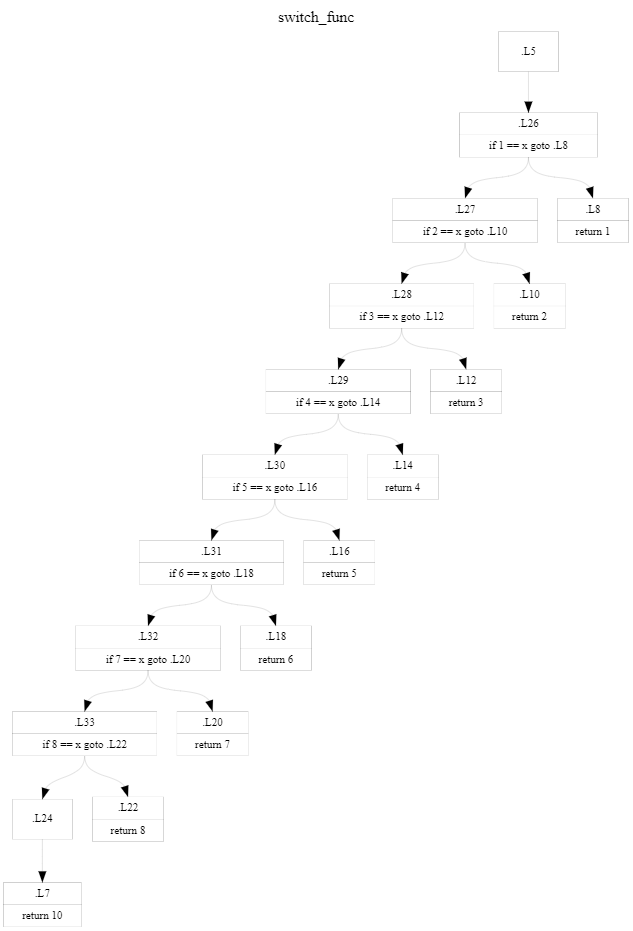
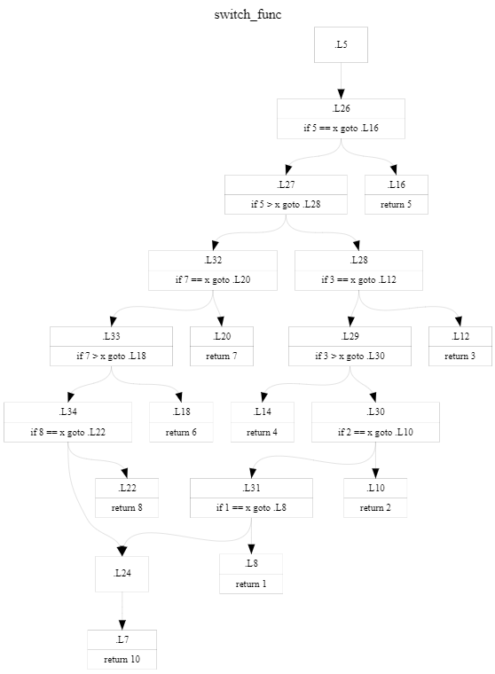

# Some Technical Notes

This is my small note of what I have done in the development.

## Loop Condition

Loop condition was moved to the bottom of the loop.
For example, here is the `sum` function.

```c
int sum(int n)
{
    int r = 0;
    for (int i = 1; i <= n; ++i) {
        r += i;
    }
    return r;
}
```

The original `lacc` generates the code below.
There are 2 `jmp` instructions in the loop.

```asm
sum:
    push    %rbp
    movq    %rsp, %rbp
    subq    $32, %rsp
    movl    %edi, -8(%rbp)
.L5:
    movl    $0, -16(%rbp)
    movl    $1, -24(%rbp)

; ------------------------------------------ main loop
.L6:
    movl    -24(%rbp), %eax
    cmpl    %eax, -8(%rbp)
    jnge    .L9
.L7:
    movl    -24(%rbp), %eax
    addl    %eax, -16(%rbp)
.L8:
    addl    $1, -24(%rbp)
    jmp     .L6
; ------------------------------------------

.L9:
    movl    -16(%rbp), %eax
    leave
    ret
```

`kcc` generates the code below.
The main loop is the blocks from `.L7` to `.L9`.
You will see the `jmp` instruction is only 1 instruction in the loop.
This means a non-conditional jump has been erased from inside the loop.

```asm
sum:
    pushq   %rbp
    movq    %rsp, %rbp
    subq    $32, %rsp
    movl    %edi, -8(%rbp)
.L5:
    movl    $0, -16(%rbp)
    movl    $1, -24(%rbp)
.L6:
    jmp     .L9

; ------------------------------------------ main loop
.L7:
    movl    -24(%rbp), %eax
    addl    %eax, -16(%rbp)
.L8:
    addl    $1, -24(%rbp)
.L9:
    movl    -24(%rbp), %eax
    cmpl    %eax, -8(%rbp)
    jge     .L7
; ------------------------------------------

.L10:
    movl    -16(%rbp), %eax
    leave
    ret
```

## Binary Search for Switch-Case

I added a binary search algorithm for the switch-case statement.
But unfortunately it gives us not so big improvement.
Now as tests has been passed with both algorithms,
then it uses a binary search when the count of branches are 4 or more.

For the switch case below:

```c
int switch_func(int x)
{
    switch (x) {
    case 1: return 1;
    case 2: return 2;
    case 3: return 3;
    case 4: return 4;
    case 5: return 5;
    case 6: return 6;
    case 7: return 7;
    case 8: return 8;
    default:
        break;
    }
    return 10;
}
```

Here is the original algorith.
It is a simple 'if-else'.



Here is a binary search algorithm, and you will see the number of comparison is increased.
That would be one of the reasons why there is not so improved.



I will be going to implement jump table for the switch case in the future.

## Calling Convention between Microsoft x64 and System V

This is only for Windows, and not for Linux.
Basically, the differences between conventions are below.

|           | Arg(1) | Arg(2) | Arg(3) | Arg(4) | Arg(5)  | Arg(6)  | ... and more |
| --------- | :----: | :----: | :----: | :----: | :-----: | :-----: | :----------: |
| Microsoft | `rcx`  | `rdx`  |  `r8`  |  `r9`  | (stack) | (stack) |   (stack)    |
| System V  | `rdi`  | `rsi`  | `rdx`  | `rcx`  |  `r8`   |  `r9`   |   (stack)    |

And also for SSE, it uses `xmm0` to `xmm3` for Microsoft and uses `xmm0` to `xmm7` for System V.
But when those are mixed, it is pretty complex.

Here is the example.

|           | Arg(1)<br />`int` | Arg(2)<br />`double` | Arg(3)<br />`int` | Arg(4)<br />`double` |
| --------- | :---------------: | :------------------: | :---------------: | :------------------: |
| Microsoft |       `ecx`       |        `xmm1`        |       `r8d`       |        `xmm3`        |
| System V  |       `edi`       |        `xmm0`        |       `esi`       |        `xmm1`        |

The register position is fixed with Microsoft, but not for System V.
The position on the System V style is assigned from the first register in order.

Currently the convertion between these styles only is done when calling builtin functions on JIT.
These differences do not have to be cared inside JIT code
because the compiled code is always generated by System V style.
It means this convertion is needed only when calling builtin functions
compiled as Microsoft calling convention.

Anyway now, this complexibility causes it is too hassle to generate call back
from a native function to a JIT code.

Would you please try it?
